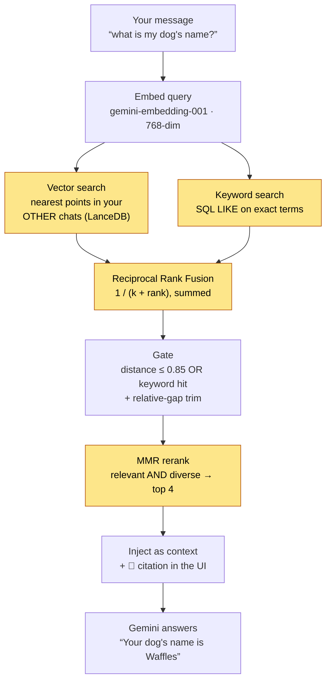

# GeminiGPT

I wanted to understand how RAG actually works, so I built a chat app where the
AI can remember things you told it in *other* conversations.

That's the whole pitch: cross-chat memory. Every message you send gets turned
into a vector embedding and stored in a vector database. Later, in a completely
different chat, the model can search that history and pull in what you said
weeks ago. Most chat apps treat every conversation as an island. I wanted to
see what it takes to make them not be.

**Live demo:** [geminigpt-n8.onrender.com](https://geminigpt-n8.onrender.com)

Heads up before you click: it's on Render's free tier, so if nobody has visited
in 15 minutes the server spins down and the first load takes 30 to 60 seconds
while it wakes up. The free tier also has an ephemeral disk, which means all
chat data resets whenever the server restarts. I knew both of those going in
and decided they were fine for a demo. More on that below, because the
deployment taught me more than the app did.

## What it does

- **Chat with Gemini** (`gemini-3.1-flash-lite`) with streaming responses over
  WebSockets
- **Cross-chat memory**: every message is embedded and indexed, and before each
  reply the app automatically searches your *other* chats for relevant context
  and shows you a citation for anything it recalled, no asking required. (The
  model also still has a `search_chat_history` function tool it can call
  explicitly.) The retrieval pipeline does hybrid keyword+vector search and
  reranks for diversity — more on why below.
- **Bring your own key (BYOK)**: paste in your own free Gemini API key and use
  the app with no signup. There's also a shared server key as a fallback so
  visitors can try it with zero setup.
- **Documents and images**: upload PDFs, DOCX files, or images and chat about
  them. Document text gets indexed into the vector DB too.
- **Function calling**: web search, stock prices, weather, time zones
- **The usual chat app stuff**: multiple chats, auto-generated titles, export
  to JSON/Markdown, keyboard shortcuts, dark mode

## What I was trying to learn

I kept reading about RAG (retrieval-augmented generation) and nodding along
without really getting it. Tutorials would say "embed your documents and store
them in a vector database" and I'd think, okay, but what *is* an embedding,
physically? What does the database actually store? When does retrieval happen?

So I picked a project where I couldn't fake my way through it. The goals:

1. Understand embeddings and vector search by wiring them up myself
2. Build real-time streaming chat and learn why WebSockets instead of HTTP
3. Ship something publicly, on a free tier, and deal with whatever broke

All three happened. Especially the third one.

## How the cross-chat memory works

Here's my best learner's explanation of the pipeline, because writing it down
is how I made sure I actually understood it.



*(GitHub renders the diagram above; the amber boxes are the retrieval-quality
work — hybrid search + fusion + reranking. Plain-text version lives in the
[build log](docs/blog/building-cross-chat-memory.md).)*

**What an embedding is.** When you send a message, I pass the text to Google's
`gemini-embedding-001` model and get back a list of 768 numbers. That list is a
point in 768-dimensional space, and the magic property is that texts with
similar *meaning* land near each other. "My dog's name is Biscuit" and "what
did I say my pet was called?" end up close together even though they share
almost no words. That's the part that finally made vector search click for me:
it's not keyword matching, it's measuring distance between meanings.

**What gets stored.** Each user/assistant message pair gets embedded and
written to LanceDB (an embedded vector database, like SQLite but for vectors)
along with the raw text, the chat ID, the chat title, and a `user_id`. The
`user_id` filter matters: searches are always scoped to one user, so you can
only ever recall your own history. Embeddings also go through an LRU cache so
I don't pay to re-embed identical text.

**How retrieval happens.** Before every reply, the server embeds your incoming
message, LanceDB finds the nearest stored vectors across your *other* chats,
and any relevant snippets get injected into the prompt — with a citation shown
in the UI for where each memory came from. It happens on every message, so the
model recalls things without you having to ask it to look. The older
`search_chat_history` function tool still exists too, for when the model wants
to search explicitly mid-answer.

This started as a "the model has to *decide* to search" function tool, and the
honest limitation was that it often didn't realize a question depended on an
old conversation. Making retrieval automatic fixed that — but it surfaced a new
problem, which is that automatic retrieval is only as good as what it retrieves.
That sent me down the rabbit hole in "Making retrieval not embarrassing" below.

**Why two databases.** SQLite holds the chats themselves: ordered messages,
titles, timestamps, the stuff you render in the sidebar. LanceDB holds the
vectors for similarity search. I originally thought one database should do
both, and technically you can bolt vector extensions onto SQLite, but keeping
them separate made each one simple to reason about.

## Making retrieval not embarrassing

Once auto-retrieval was live, I started actually reading what it pulled in. A
lot of it was junk. The version in every tutorial — embed the query, grab the
four nearest vectors, stuff them in the prompt — has three specific failure
modes I only understood after watching it fail on my own chats. Fixing each one
was a separate little experiment.

**1. Lone messages have no context.** I was embedding each message on its own,
so a stored vector for "yeah, the second one" is meaningless — pulled up later,
it tells the model nothing. The fix is *chunking*: instead of one row per
message, I store one row per turn, combining the user's message with the
assistant's reply. The embedded text reads like `User: … / Assistant: …`, so a
recalled snippet carries its own meaning. Bonus: it roughly halved the
near-duplicate rows I used to dedupe — a question and its echoed answer used to
be two nearly identical vectors.

I almost over-engineered this. My first version also glued the *previous* turn
into each chunk, figuring more context is better. Then I ran a live test on the
deployed app: I told it my dog's name in one chat and, in a different chat,
asked something totally unrelated — and it cited the dog chat anyway, because
the dog turn had been windowed into the next chunk and dragged along. The "more
context" was actually cross-contamination. I tore the windowing back out. The
assistant's own reply already carries enough context, and one clean turn per
chunk keeps both retrieval and the citations honest. Reading what the thing
actually retrieves beats reasoning about what it should.

**2. Vectors are bad at exact words.** Embeddings capture *meaning*, which is
the whole point — but that makes them weirdly bad at the one thing keyword
search is trivially good at: matching an exact rare token. Tell one chat your
dog is named "Waffles", later ask "what's my dog called", and semantic search
nails it. But ask for an error code like `ERR_PACKAGE_PATH_NOT_EXPORTED` and the
nearest vector might be some *other* error you discussed, because "an error
code" and "a different error code" sit close together in meaning-space. So I
added a second, dumb lexical search (SQL `LIKE`) running alongside the vector
search and fused the two ranked lists with **Reciprocal Rank Fusion** — a fancy
name for a simple idea: score each result by `1 / (k + rank)` summed across both
lists, so anything ranking high in *either* search bubbles up. RRF needs no
tuned weights and no shared score scale between the two searches, which is why
it's the standard move. This "hybrid search" was the single biggest quality
jump.

**3. The top results are often the same result.** Ask "what did I say about my
dog" and the four nearest vectors might be four paraphrases of one fact — you've
spent your whole context budget learning the same thing four times. The fix is
*reranking* for diversity. I used **MMR** (Maximal Marginal Relevance): instead
of taking the top four by score, greedily pick results that are both relevant
*and* different from what you've already picked, balanced by one knob (λ). I
specifically did **not** use an LLM to rerank, even though that's the trendy
answer — this runs on a shared free API key, and spending an extra model call on
every message just to reorder four snippets is exactly the kind of cost that
sinks a free demo. MMR is pure math on vectors I already have, so it's
effectively free.

The meta-lesson: "RAG" in a tutorial is one line. Making it *good* is a pipeline
of small corrections, each one patching a specific way the naive version
embarrasses you. I learned more from reading bad retrievals than from any amount
of reading *about* retrieval.

## The deploy saga

This is the section I'd want to read if I were me six months ago. The app
worked locally for weeks. Deploying it to Render produced four different
failures, in order, each one teaching me something I thought I already knew.

**1. npm peer-dependency hell.** My lockfile had been built with
`legacy-peer-deps=true` to paper over a conflict: LanceDB wanted one version of
`apache-arrow` and something else wanted another. It worked on my machine with
npm 10. Render runs npm 11, which is stricter, and the install exploded. The
fix took me a while to understand: I pinned `apache-arrow` to exactly `18.1.0`
(the version LanceDB actually wants), and later migrated next-auth from v4 to
v5 to remove the other conflict, so the dependency tree is now honest with no
flags hiding anything. Lesson: `legacy-peer-deps` doesn't fix conflicts, it
just defers them to a worse moment.

**2. The crash loop.** The server demanded `GEMINI_API_KEY` at boot and exited
if it was missing. But the whole point of BYOK is that the server key is
optional! Render kept restarting the process and it kept dying. I had written
"the server key is a fallback" in my own docs while the code treated it as
required. Now the server boots without it and just disables the features that
need it, with a warning.

**3. devDependencies missing at build.** Render sets `NODE_ENV=production`,
which makes `npm install` skip devDependencies, and then `next build` couldn't
find `typescript`. This one confused me because the build is a *build*, it
needs the dev tools. The fix was telling Render to install everything during
the build step. Lesson: production runtime and production build have different
needs, and `NODE_ENV` affects installs, not just your app code.

**4. The sneakiest one.** Everything deployed. The health check passed. The
site returned 502. The server was binding to `process.env.HOSTNAME`, which on
my machine was harmless, but container platforms set `HOSTNAME` to the
container ID. So my server was listening on a hostname like `srv-abc123` while
Render's proxy was knocking on a door nobody answered. This took me an
embarrassing amount of log-reading to find because nothing was *erroring*.
Lesson burned into my brain: in a container, bind to `0.0.0.0`, always.

There's a fifth lesson hiding in the hosting choice itself: this app can't run
on Vercel at all. Vercel is serverless, meaning your code runs in short-lived
functions that spin up per request. A WebSocket server needs one long-lived
process holding connections open. So the architecture decided the host for me,
which is something I now think about *before* writing code.

## Other things that clicked along the way

**WebSockets vs HTTP for streaming.** I started out assuming I'd just hit an
API route. But streaming tokens back, plus typing indicators, plus events like
"your message got rate limited", all flowing both directions over one
connection, is exactly what WebSockets are for. The custom `server.js` runs
Next.js and Socket.IO on the same port, which also means the client just
connects to the page's own origin with no separate API URL to configure.

**The economics of a free demo.** BYOK means visitors who bring a key cost me
nothing. The shared fallback key is the risky part: it's one key anyone can
burn through. The defenses are a token-bucket rate limiter on the server
(60 messages/minute, 500/hour per user by default; users on their own key skip
it) and a hard budget cap on the key in Google's console as the real ceiling.

**Being honest about where the key goes.** An early version of this README
claimed your API key "never touches our servers." Writing the code taught me
that wasn't quite true: the key is stored in your browser's localStorage, but
it travels over the WebSocket to the server, which uses it for the Gemini call.
It's never stored server-side, but "stored only in your browser" and "only
your browser ever sees it" are different claims, and I'd rather make the
accurate one.

**A model can get retired out from under you.** For months, embeddings ran on
`text-embedding-004`. Then one day cross-chat memory just… stopped recalling
anything in production, with no error in my code — Google had retired the model
and the API was quietly 404ing on every embed call. The fix was migrating to
`gemini-embedding-001`, which has its own wrinkle: it defaults to 3072
dimensions, and at the 768 I truncate to (to keep my existing table) it returns
*un-normalized* vectors, so I now L2-normalize them myself or the distance math
breaks. Lesson: a hosted model is a dependency like any other, except it can
disappear without you running an install. I should have been monitoring the
retrieval path, not assuming "no code changed" meant "still working."

**Ephemeral disk as a feature.** Render's free tier wipes the disk on every
restart, so SQLite and LanceDB start fresh. For a demo this turned out to be a
gift: no stale data piling up, no cleanup jobs, and nobody's test conversations
hang around forever. For a real product it would be disqualifying. Knowing
which one you're building is the skill.

## What I'd do differently

- **Deploy a walking skeleton on day one.** All four deploy failures would
  have been found months earlier, one at a time, instead of in a single
  miserable evening.
- **Build retrieval as automatic from the start.** I went with the function
  tool because it was easier, but "the model only remembers when it feels like
  it" is a confusing user experience, and retrofitting auto-retrieval is more
  work than designing it in.
- **Fewer features, sooner.** Stock prices and weather lookups were fun to
  wire up but taught me little. The vector search taught me a lot. I'd trade
  the former for more iterations on the latter.
- **Never reach for `legacy-peer-deps`.** See above.

## Quick start

```bash
git clone https://github.com/n8watkins/GeminiGPT.git
cd GeminiGPT
npm install
npm run dev
```

The dev server picks a random port and prints it, something like:

```text
✅ Server listening on http://localhost:23517
```

You can chat right away by pasting a Gemini API key into the app (free from
[Google AI Studio](https://aistudio.google.com/apikey), takes about two
minutes). Optionally, set a server-side fallback key so the app works without
one:

```bash
# .env.local (optional)
GEMINI_API_KEY=your_key_here
```

Needs Node 22+. SQLite and LanceDB files get created in `data/` automatically.

## Stack

| Layer | Choice | Why |
| ----- | ------ | --- |
| Framework | Next.js 16 + React 19 + TS | App router frontend |
| Server | Custom `server.js` (Node) | Next.js + Socket.IO on one port |
| Real-time | Socket.IO | Streaming responses, bidirectional events |
| Chat storage | SQLite (better-sqlite3) | Simple, fast, zero-config |
| Vector DB | LanceDB | Embedded, no separate service to run |
| LLM | `gemini-3.1-flash-lite` | Generous free tier, function calling |
| Embeddings | `gemini-embedding-001` (768-dim) | Same free tier |
| Styling | Tailwind CSS | |
| Hosting | Render free tier | Long-lived process, $0 |

## Docs

**📝 Build log: [I taught a chatbot to remember things I said in *other* chats — here's everything that broke](docs/blog/building-cross-chat-memory.md)** — the human version of this project: embeddings clicking, the deploy saga, a retired model, and the retrieval-quality rabbit hole (chunking, hybrid search, MMR, threshold tuning). Start here if you want the story.

Deeper documentation I wrote while building:

- [WebSocket API](docs/WEBSOCKET_API.md) - events, auth, rate limiting
- [HTTP API](docs/HTTP_API.md) - REST endpoints and health checks
- [Database schema](docs/DATABASE_SCHEMA.md) - SQLite tables and LanceDB vectors
- [Deployment guide](docs/DEPLOYMENT_GUIDE.md) - host comparison and env vars
- [RAG overhaul plan](docs/RAG_OVERHAUL_PLAN.md) - where the retrieval work is headed
- [Contributing](CONTRIBUTING.md)

## Author

**Nathan Watkins**, learning in public.

- Portfolio: [n8sportfolio.vercel.app](https://n8sportfolio.vercel.app/)
- GitHub: [@n8watkins](https://github.com/n8watkins)
- LinkedIn: [n8watkins](https://www.linkedin.com/in/n8watkins/)
- Twitter: [@n8watkins](https://x.com/n8watkins)

MIT licensed. If you're also learning this stuff and something here is wrong
or unclear, [open an issue](https://github.com/n8watkins/GeminiGPT/issues),
I'd genuinely like to know.
