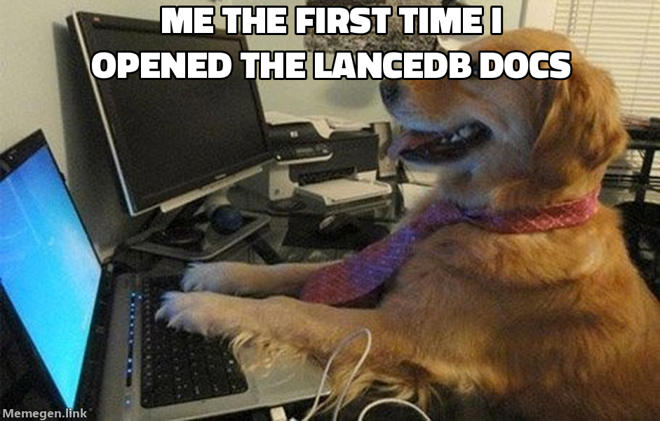
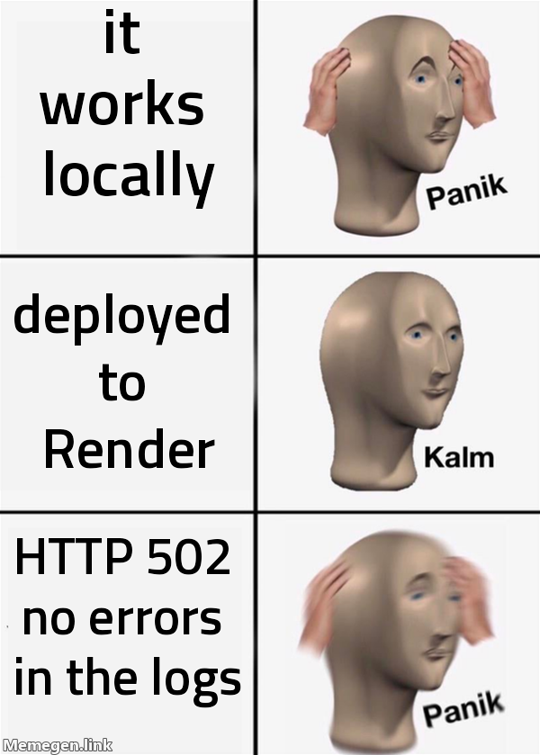
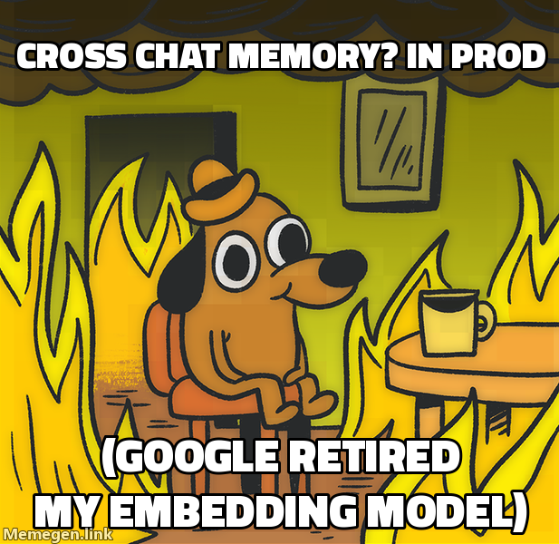
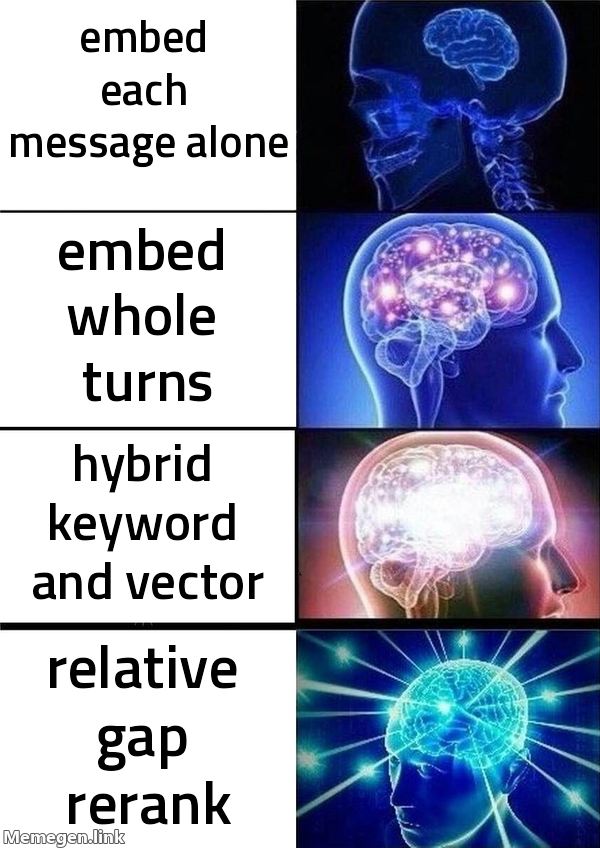
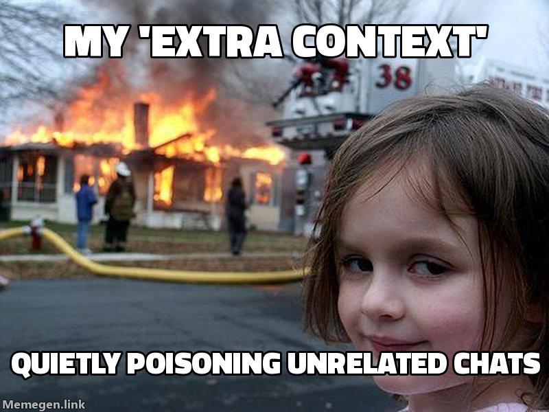
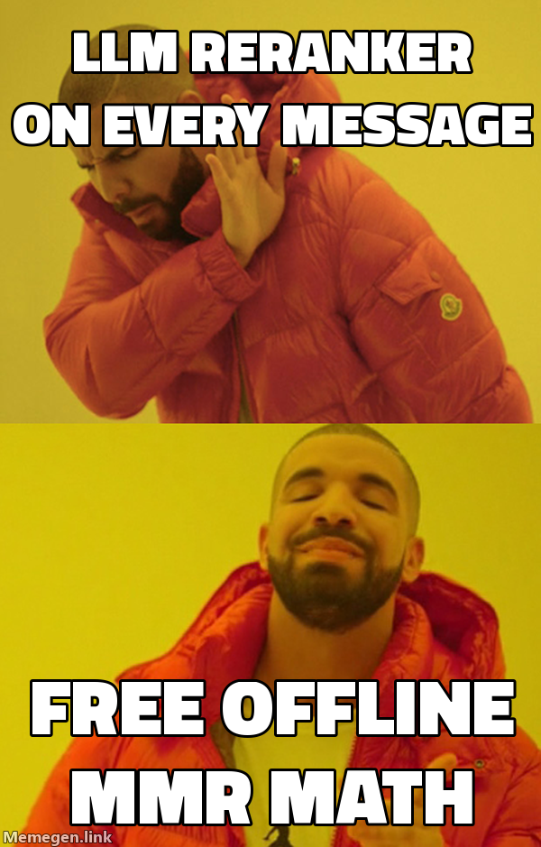
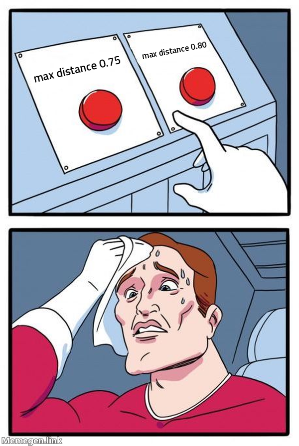

# I taught a chatbot to remember things I said in *other* chats — and learned that "RAG" is a lie of omission

*A build log from someone who learned RAG the hard way: by watching it fail.*

Every RAG tutorial — the embed-your-data-so-the-AI-can-use-it thing — ends at the
same four words: *embed, store, search, answer.* That's the **demo.** I learned
the hard way that it's also where the actual problems *start*, by building a chat
app whose entire personality is **cross-chat memory**: tell it your dog's name in
one conversation, ask about your dog in a completely different one, and it
remembers. Most chat apps treat every conversation as an island — I wanted to
build the bridges, and I figured I'd understand RAG by the end whether I liked it
or not.

Reader, I did not always like it.


*Me, opening the vector database docs for the first time.*

## First, the one idea you actually need

An embedding is just a list of numbers — 768 of them, for the model I use — and
that list is a **point in space.** The magic property: text with similar
*meaning* lands in nearby points. "My dog's name is Biscuit" and "what did I call
my pet?" end up neighbors even though they share almost no words. Search isn't
keyword matching — it's measuring the **distance between meanings.** Writing that
sentence myself is the moment it finally clicked. I store every message as one of
these points (in LanceDB, an embedded vector database), and to "remember," I turn
your new question into a point and grab its nearest neighbors.

Cool. Ship it. How hard could the rest be?

## It worked perfectly on my machine



Deploying it produced four failures in a row, each one teaching me something I
thought I already knew: npm peer-dependency hell (from a `legacy-peer-deps` flag
that doesn't *fix* conflicts, it just defers them to the worst moment); a crash
loop because the server *demanded* an API key it should've treated as optional;
missing build tools because `NODE_ENV=production` skips devDependencies; and the
sneaky one — a 502 because I bound to the container's hostname instead of
`0.0.0.0`. (Full saga in the [README](../../README.md).) Then production threw me
a curveball I *couldn't* have prevented: Google **retired the embedding model**
I was using, and cross-chat memory silently died — no error, no failed deploy,
just 404s on every embed call. A hosted model is a dependency that can vanish
without you running an install.


*Production, allegedly.*

## The real work: naive vector search fails in three predictable ways

Here's the part the tutorials skip. Once retrieval was automatic, I started
actually **reading what it pulled back** — and a lot of it was junk, in three
specific flavors. Fixing each one was its own little experiment.


*The real evolution of this project's retrieval, bottom to top.*

**1. Lone messages have no context.** A stored vector for "yeah, the second one"
is meaningless. So I chunk by *turn* now — your message **and** the reply,
together — and each chunk describes itself. I also over-corrected: my first
version glued the *previous* turn into every chunk too ("more context is
better!"). A live test demolished that idea — I mentioned my dog in one chat and,
in an unrelated chat, the app cited it anyway, because the dog turn had been
windowed into its neighbor and dragged along. **More context wasn't free; it was
cross-talk.** I tore it out.


*Me, realizing my "extra context" was quietly contaminating unrelated chats.*

**2. Vectors are weirdly bad at exact words.** Embeddings capture meaning — which
is the point — but that makes them terrible at the one thing keyword search is
great at: an exact rare token like `ERR_PACKAGE_PATH_NOT_EXPORTED`. To a vector,
"an error code" and "a *different* error code" are basically the same place. So I
added a dumb lexical keyword search next to the smart vector one and fused the two
ranked lists with **Reciprocal Rank Fusion** — score each result by `1/(k+rank)`
summed across both lists, so anything ranking high in *either* search floats up.
No tuned weights, no shared score scale. **Biggest single quality jump in the
project.**

**3. Your top results are often the same result.** Ask about your dog and the
four nearest vectors might be four paraphrases of one fact — you've spent your
whole context budget learning it four times. Fix: **MMR reranking**, which picks
results that are relevant *and* different from each other. The trendy move is to
ask an LLM to rerank — I didn't, on purpose:



This runs on a **shared free API key.** An extra model call on *every message*
just to reorder four snippets is exactly how a free demo goes broke. MMR is pure
math on vectors I already have. Effectively free.

## The finale: the threshold I almost guessed at

Last boss. My retrieval ignored anything past a distance of `0.85`, and a weak,
irrelevant result kept sneaking under it. My instinct: lower the number. To 0.80?
0.75? I had no idea — so I was about to just pick one.



Instead I built a tiny harness, embedded a labeled set of questions and facts for
real, and **measured.** The data ended the debate in ten minutes: the legit
*paraphrased* matches I wanted to keep reached **~0.76**, and the false positives
I wanted to drop sat at **~0.69–0.80.** They **overlap.** There is no single
cutoff that keeps the good and drops the bad — I'd been reaching for the wrong
*kind* of lever the whole time. The real fix was a **relative** rule: keep results
within a small gap of the *best* match for each query (the right answer is
essentially always the closest one, so it costs zero recall). I shipped it,
re-ran the live test, and the dog question finally came back with exactly one
correct citation. 🎉

## The whole machine, on one screen

After all that, here's the read path a single message actually flows through:

```text
            "what is my dog's name?"
                       │
                       ▼   embed → 768-dim vector
               ┌───────┴────────┐
               ▼                ▼
         ┌───────────┐    ┌────────────┐
         │  VECTOR   │    │  KEYWORD   │
         │  search   │    │  search    │   meaning   vs.   exact tokens
         │ (LanceDB) │    │ (SQL LIKE) │
         └─────┬─────┘    └─────┬──────┘
               │ ranked         │ ranked
               └───────┬────────┘
                       ▼
             ┌────────────────────┐
             │ Reciprocal Rank     │   merge the two rankings
             │ Fusion · 1/(k+rank) │
             └─────────┬──────────┘
                       ▼
             ┌────────────────────┐
             │ gate + relative-gap │   drop the far / irrelevant hits
             │ trim                │
             └─────────┬──────────┘
                       ▼
             ┌────────────────────┐
             │ MMR rerank → top 4  │   relevant AND not duplicates
             └─────────┬──────────┘
                       ▼
            inject as context  +  📎 citation
                       ▼
          "Your dog's name is Waffles 🐶"
```

Every box past "embed" is a thing I added *after* the tutorial ended.

## What I actually learned

- **Tutorials show the demo; production is everything after.** "Embed, store,
  search, answer" hides chunking, hybrid search, reranking, and threshold tuning.
- **Read your model's *bad* output.** Every fix above came from staring at a junk
  retrieval — not from reading another article about RAG.
- **Measure before you tune.** I almost shipped a guessed threshold that was
  *structurally incapable* of working. Numbers beat vibes.
- **Test the deployed thing.** My unit tests were green the entire time the live
  app was citing the wrong chat. Mocks can't catch what real data does.
- **Hosted dependencies can disappear** — with zero code changes and zero errors.

If you're also learning this stuff and something here is wrong or unclear,
[open an issue](https://github.com/n8watkins/GeminiGPT/issues) — I'd genuinely
like to know.

*— Nathan, learning in public*
